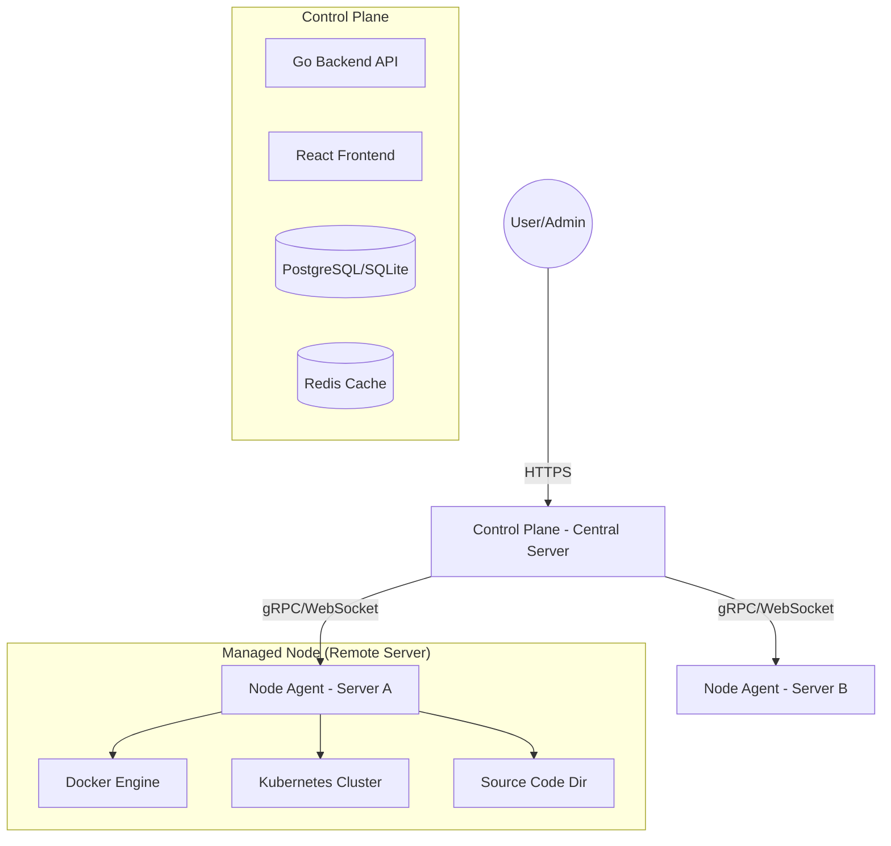

# System Architecture – Multi Server Source Manager

## Goal
A centralized platform to manage multiple servers and all their source code deployed via Docker and Kubernetes. It provides a unified interface for server monitoring, repository management, and deployment orchestration.

## Architecture Diagram (Logical)


## Main Components

### 1. Control Plane (Backend & Frontend)
The central management unit that aggregates data from all nodes and provides the user interface.

**Responsibilities:**
- Server registration and lifecycle management.
- Centralized Source Code Repository management (Git integration).
- Docker deployment and container orchestration.
- Kubernetes cluster discovery and management.
- User AUth (OAuth2/JWT) and permissions (RBAC).
- Audit logging and monitoring alerts.

### 2. Node Agent
A lightweight binary installed on each target server.

**Responsibilities:**
- Scanning source code directories for projects.
- Inspecting Docker containers, images, and volumes.
- Fetching Kubernetes workload status.
- Executing deployment commands (pull, build, up).
- Sending real-time heartbeats and metrics to the Control Plane.

## Project Structure (Monorepo)

The project is organized as a monorepo containing both Backend, Frontend, and shared packages.

```text
einfra/
├── api/                # Go Backend (Control Plane & Shared Logic)
│   ├── cmd/            # Main entry points (server, agent, cli)
│   ├── internal/       # Core business logic (Clean Architecture)
│   │   ├── domain/     # Definitions: Entities, Value Objects, Repository Interfaces
│   │   ├── usecase/    # Application logic: Business rules orchestration
│   │   ├── infrastructure/ # External services: DB, Docker, K8s, Redis, Harbor, Kafka
│   │   ├── http/       # API Layer: Handlers, Routers, Middlewares (Gin/Mux)
│   │   ├── monitoring/ # Health checks, Metrics, Audit logging
│   │   └── ...         # Utils: Auth, Config, Constants, Logger
│   ├── config/         # System configurations (.yaml, .env)
│   ├── templates/      # Email or HTML templates
│   └── docs/           # API Documentation (Swagger)
├── app/                # React Frontend (Control Plane UI)
│   ├── src/            # Root source code
│   │   ├── features/   # Feature-Sliced Design (FSD) Domain Modules
│   │   │   ├── servers/         # Server Management
│   │   │   ├── docker/          # Docker & Container Management
│   │   │   ├── kubernetes/      # K8s Orchestration
│   │   │   ├── repositories/    # Source Repositories & Registries
│   │   │   ├── monitoring/      # System Monitoring & Logs
│   │   │   ├── authentication/  # Login & Auth
│   │   │   ├── users_teams/     # IAM & RBAC
│   │   │   └── settings/        # System Config
│   │   ├── core/       # Global utilities, Hooks, Types (shared)
│   │   ├── components/ # Global shared UI elements (e.g. Layout)
│   │   └── routes/     # Central React Router configuration
│   └── public/         # Static assets
├── pkg/                # Shared Go packages used throughout the system
│   ├── algorithm/      # Shared algorithms
│   └── utils/          # Common utility functions
├── k8s/                # Kubernetes manifests for deploying EINFRA
└── ARCHITECTURE.md     # This document
```

## Communication Protocol
- **Control Plane <-> User**: REST API / WebSockets.
- **Control Plane <-> Node Agent**: 
    - **Primary**: gRPC for high-performance command execution.
    - **Fallback/Real-time**: WebSockets or Reverse Tunnel for agents behind NAT.

## Data Model
- **Server**: Metadata about managed nodes (IP, OS, Specs).
- **SourceProject**: Path, Git URL, branch info of source code on nodes.
- **DockerService**: Container definition, status, and logs.
- **KubernetesWorkload**: Deployments, Pods, Services status.
- **Deployment**: History of deployment activities and rollbacks.

## Integration Status
The project is currently a unified monorepo merging the original `einfra` core and `einfra-crm-be` modules.
- **Backend**: Unified under `api/` and `pkg/` with a shared `go.mod`.
- **Frontend**: Located in `app/`.
- **Frameworks**: Currently supports both `Gin` and `Mux` handlers during the transition period. New handlers should prefer the unified architecture patterns defined in `api/internal/`.

## Development & Build
- **Backend**: `cd api && go run cmd/api/main.go` (Core) or `cd api && go run cmd/server/main.go` (CRM).
- **Frontend**: `cd app && npm run dev`.
- **Unified Build**: Use the root `Makefile` for multi-service builds.

## Frontend Development Roadmap

**Phase 1: Servers Management (In Progress)**
- `ServersPage`: Monitor and list managed nodes.
- `AddServerPage`: Provision and add new nodes via SSH, Agent, or Bastion.
- `ServerDeepLayout`: Deep-dive server detail overview (System, Network, Services, Cron).

**Phase 2: Docker Management (Planned)**
- `ContainersPage`: View all running and stopped containers.
- `ImagesPage`: Overview of available local and registry images.
- `ContainerDetailPage`: Start, Stop, Logs, Exec Terminal.

**Phase 3: Kubernetes Explorer (Planned)**
- `PodsPage`: Monitor pod health and replication.
- `DeploymentsPage`: Manage rollouts and autoscaling.
- `ServicesPage`: Networking mapping and Ingress routing.
